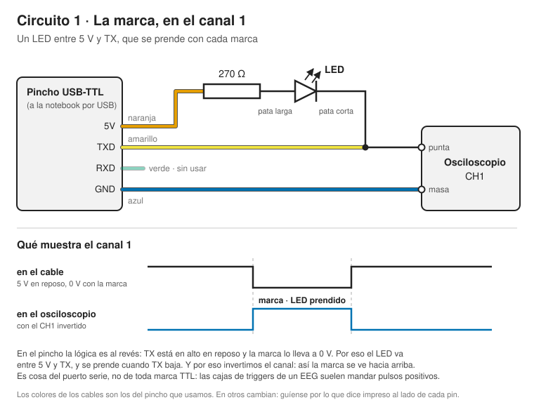
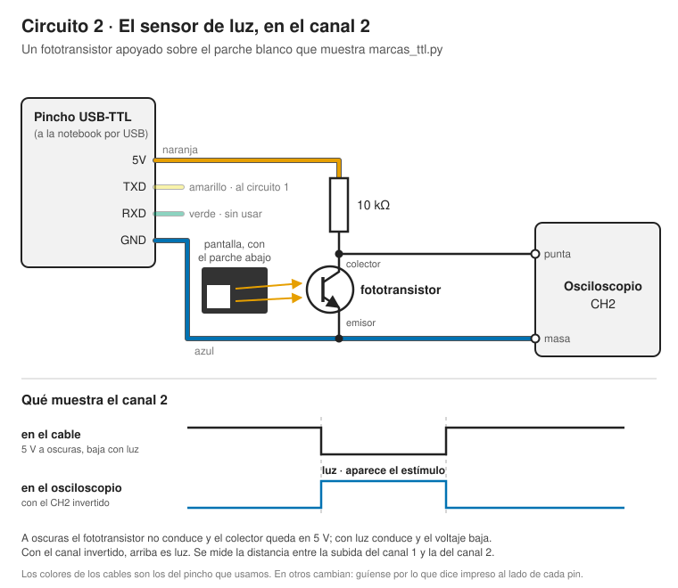
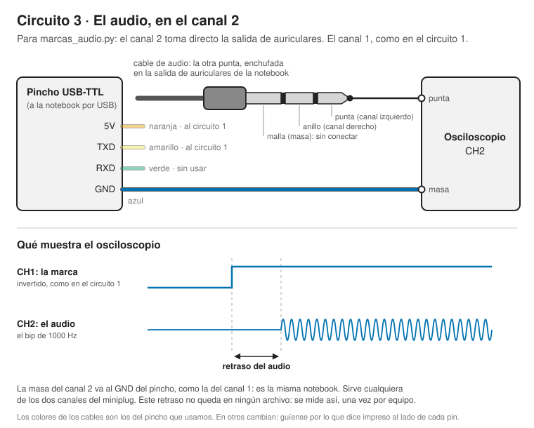

# Demos de marcas TTL

El software de los dos demos en vivo del bloque de sincronización y
hardware del día 2. Preparación completa del montaje —qué conseguir,
cómo cablearlo, el guion, los respaldos— en
[`docs/12_marcas_e_instrumentos.md`](../../docs/12_marcas_e_instrumentos.md).

| Archivo | Qué es |
|---|---|
| `marcas_ttl.py` | **Demo visual**: un parche en pantalla y una marca por cada aparición, antes o después del `flip` |
| `marcas_audio.py` | **Demo de audio**: un bip y una marca, con el sonido pedido de tres maneras |
| `puerto_marcas.py` | `TriggerPort`, el puerto por el que salen las marcas, compartido por los dos demos |
| `probar_usb_ttl.py` | Manda marcas sueltas, sin PsychoPy: para probar el pincho, el LED y el osciloscopio |
| `arduino_usb2ttl.ino` | Sketch que convierte un Arduino en una caja de triggers de 8 líneas |
| `circuito_*.svg` | Los tres circuitos del demo, con lo que muestra cada canal |

Los scripts de los demos corren sin ningún hardware con
`BACKEND = "simulado"`, y `probar_usb_ttl.py` con `DRY_RUN = True`: las
marcas van al `.log` y a un CSV en `data/`, al lado del script.

---

## El hardware

### El pincho USB-TTL

Un pincho USB-TTL genérico (CH340, CP2102, FTDI) no es una caja de
triggers: no saca un byte por ocho cables. Pero tiene líneas que se
pueden llevar a bajo desde el código, y el **flanco de bajada es la
marca**. `SERIAL_SIGNAL` elige cuál:

| `SERIAL_SIGNAL` | Qué pasa en el pincho | Para qué |
|---|---|---|
| `"break"` | TX queda en bajo mientras dura el estímulo | **La opción por defecto.** Todos los pinchos tienen TX, y un LED se ve prendido |
| `"dtr"` / `"rts"` | Lo mismo en el pin DTR o RTS | Si el pincho los tiene y se prefiere dejar TX libre |
| `"byte"` | Sale un byte como trama serie por TX: un pulso de ~1 ms a 9600 baudios | Cajas de triggers y el Arduino, que convierten el byte en 8 líneas |

Sirve perfecto para medir el timing. Lo que **no** sirve es enchufarlo
a la entrada de triggers de un EEG, que espera un código estable en
paralelo: para eso está el Arduino o una caja comercial.

En el pincho **la lógica es al revés**: la línea está siempre en alto y
la marca la lleva a 0 V. Es cosa del puerto serie, no de toda marca
TTL: las cajas de triggers de un EEG suelen mandar pulsos positivos.
Por eso, en el osciloscopio, invertimos los dos canales: así la marca y
la luz se ven hacia arriba.

### Circuito 1: la marca, en el canal 1



Para que el aula vea la marca, un LED **entre 5 V y TX**:

```
5 V ── 270 Ω ── pata larga del LED ── pata corta ── TX
```

- En reposo TX está en alto, igual que los 5 V: el LED está apagado.
- Con la marca TX baja: el LED se prende mientras dura el estímulo.
- Con 270 Ω pasan unos 10 mA, que la línea maneja sin deformar la
  señal que ve el osciloscopio.
- Si queda al revés (TX → resistencia → LED → GND), funciona igual
  pero invertido: prendido en reposo, apagado con la marca.

La punta del CH1 va a TX y su masa al GND del pincho.

### Circuito 2: el sensor de luz, en el canal 2



Un fototransistor apoyado sobre el parche blanco, en la esquina inferior
izquierda de la pantalla: el colector a los 5 V del pincho con una
resistencia de 10 kΩ, el emisor al GND, y la punta del CH2 en el
colector. A oscuras no conduce y el colector queda cerca de 5 V; **con
luz conduce y el voltaje baja**. Taparlo con cinta negra o un trapo, y
el brillo de la pantalla al máximo.

Si no hay fototransistor, sirve un fotodiodo (BPW34 o similar) o
incluso un LED común: pata larga a la punta del CH2, pata corta a la
masa, sin resistencia. La señal es de décimas de volt.

### Circuito 3: el audio, en el canal 2



Para `marcas_audio.py`, el CH2 toma directo la salida de auriculares:
un cable de audio enchufado en la notebook, y la punta del CH2 en la
punta del miniplug (canal izquierdo; sirve también el anillo, el
derecho). La masa sigue siendo la del pincho, porque es la misma
notebook, y la malla queda sin conectar. El CH1, como en el circuito 1.

---

## Demo visual — `marcas_ttl.py`

Muestra un parche blanco en la esquina inferior izquierda —el que mira
el sensor de luz— y manda una marca en cada aparición. Con
`SERIAL_SIGNAL = "break"` la marca dura lo que dura el parche, así que
el LED se prende junto con el estímulo.

| `TRIGGER_TIMING` | Qué pasa |
|---|---|
| `"antes_del_flip"` | El error clásico: la marca sale cuando el código la pide, hasta un frame antes de que el estímulo exista |
| `"despues_del_flip"` | Lo correcto: `flip()` bloquea hasta el refresco, así que la marca sale cuando el estímulo aparece |

Lo que hay que mirar no es tanto la distancia entre los flancos como
**cuánto varía de un destello al otro**. Después del flip la luz llega
a una distancia fija de la marca: en nuestra prueba, unos 14 ms, porque
el parche está abajo y el monitor dibuja de arriba hacia abajo. Es un
retraso constante, y se corrige restando. Antes del flip, con
`GAP_MODE = "segundos"`, la distancia salta en cada destello en un
rango de un frame entero (entre 14 y 31 ms en la prueba), y eso no se
corrige con nada.

**En el OWON:** CH1 a 2 V/div; CH2, con el fototransistor, empezando en
1 o 2 V/div. Los dos canales invertidos. Base de tiempo 5 ms/div.
Trigger por flanco en CH1, pendiente de **bajada**: el trigger mira la
señal original, aunque el canal se vea invertido. Nivel a mitad de
camino entre reposo y marca, modo **Normal**, con el punto de trigger
corrido a la izquierda. Si tiene persistencia (menú *Display*),
activarla: antes del flip los flancos de luz forman una nube de un
frame de ancho; después, una línea.

Si la señal de luz tiene un serrucho fino, es el PWM del brillo de la
pantalla: con el brillo al máximo suele desaparecer.

| Constante | Por defecto | Qué cambia |
|---|---|---|
| `BACKEND` | `"simulado"` | `"serial"` para el pincho, `"parallel"` para puerto paralelo |
| `SERIAL_PORT` | `"COM3"` | `"/dev/ttyUSB0"` en Linux; `probar_usb_ttl.py` lista los que hay |
| `SERIAL_SIGNAL` | `"break"` | Ver la tabla del pincho |
| `TRIGGER_TIMING` | `"antes_del_flip"` | Antes o después del flip |
| `GAP_MODE` | `"segundos"` | Espera al azar en segundos (el código cae en cualquier punto del ciclo del monitor) o en frames (queda atado al refresco) |
| `N_FLASHES` | `100` | Cuántos destellos |
| `FLASH_FRAMES` | `12` | Duración del destello: 200 ms a 60 Hz, suficiente para ver el LED |
| `PATCH_POSITION` | `(-0.82, -0.42)` | Dónde va el parche |

---

## Demo de audio — `marcas_audio.py`

Toca una tanda de bips de 1000 Hz, sin rampa de entrada para que el
comienzo se vea nítido, y manda una marca con cada uno.

| `AUDIO_TIMING` | Qué hace | Qué se espera ver |
|---|---|---|
| `"inmediato"` | `play()` y enseguida la marca | El audio arranca **después** de la marca, varios ms, y no siempre igual |
| `"agendado"` | `play(when=t)` y la marca en `t` | Audio y marca alineados, con un resto chico y constante |
| `"con_la_pantalla"` | El sonido se agenda para el próximo `flip`, como hace el componente Sound del Builder | Audio, imagen y marca juntos |

La lección: el audio también tiene su propio retraso, y **no se ve en
ningún archivo**. Se agenda, y se mide una vez.

**En el OWON:** CH1 como en el demo visual; CH2 a 200–500 mV/div. Base
de tiempo 5 o 10 ms/div: los retrasos de audio son de varios ms, y a
100 µs/div no entran en pantalla. Trigger en CH1, modo **Único**, para
congelar un bip y medir con los cursores la distancia entre el flanco
de la marca y el comienzo de la senoide. Repetir con varios bips y
anotar cuánto varía.

El primer bip de cada corrida puede tardar más que el resto: no
tomarlo en cuenta.

| Constante | Por defecto | Qué cambia |
|---|---|---|
| `AUDIO_TIMING` | `"agendado"` | Cómo se pide el sonido |
| `N_BEEPS` | `50` | Cuántos bips |
| `BEEP_FREQUENCY` | `1000` | Frecuencia, en Hz |
| `BEEP_DURATION` | `0.2` | Duración del bip y de la marca |
| `SCHEDULE_AHEAD` | `0.1` | Con cuánta anticipación se agenda en `"agendado"` |

---

## Antes del curso: probar el montaje

1. **El pincho solo.** `probar_usb_ttl.py` con `SIGNAL = "break"` y
   `DRY_RUN = False`: cada `INTERVAL` segundos, TX tiene que bajar
   durante `PULSE_DURATION` y el LED prenderse. Si no
   aparece nada, revisar que la punta esté en TX y no en RX, el nombre
   del puerto y, en Linux, que el usuario esté en el grupo `dialout`.
   Si `"break"` no anda en ese pincho, probar `"dtr"` o `"rts"` (si
   tiene esos pines) o `"byte"` a 300 baudios, que da un pulso de
   ~30 ms.
2. **El demo visual**, las dos corridas.
3. **El demo de audio**, al menos `"inmediato"` y `"agendado"`.
4. **Guardar capturas o fotos** de cada corrida: son el respaldo si el
   día del curso algo falla.

---

## La advertencia eléctrica

El pincho y el Arduino sacan **5 V** o **3.3 V** según el modelo.
Varios amplificadores de EEG esperan 3.3 V, y entre la computadora y un
equipo conectado a una persona corresponde un **optoacoplador**. Antes
de enchufar esto a alguien, leer la sección de advertencias de
[`docs/12_marcas_e_instrumentos.md`](../../docs/12_marcas_e_instrumentos.md)
y el manual del amplificador.

Para el banco de prueba y el demo del aula, con el osciloscopio, no hay
riesgo.
